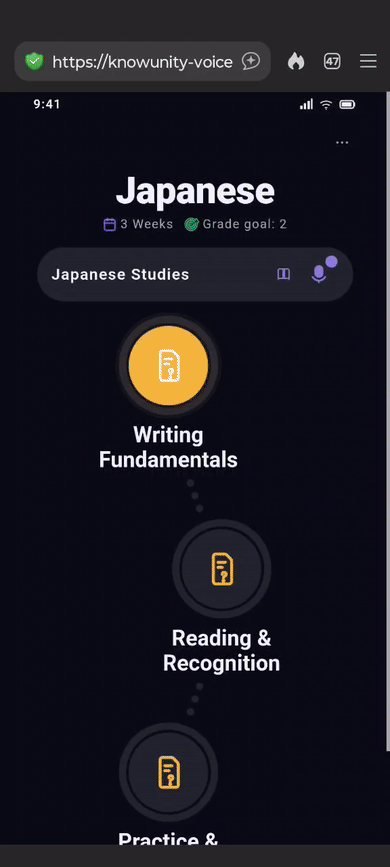

# 🎙️ Voice Recall

> **Designing confidence through retrieval.**

A product design and frontend prototype exploring how spoken active recall could become a natural extension of an existing study platform.

Built during the **Yummy Labs × Knowunity AI Design Sprint**.

<p align="center">
  
  <br>
  <sub>A quick look at the Voice Recall experience, on the mobile prototype.</sub>
</p>

**[🚀 Live prototype](https://knowunity-voice-recall-blush.vercel.app/)** · **[🎨 Figma](https://www.figma.com/design/AgElet66FviQ1jm2FwIw3R/Knowunity-%C3%97-Yummy-Labs-Sprint?node-id=1-2&t=TgwDEUT8GSFc7UFK-1)**

---

## The idea in one minute

Students often leave a revision session believing they know a topic.

They have read the notes. Completed the quiz. Reviewed the flashcards. They recognise the answers.

But recognising an answer is not the same as being able to explain it.

Something different happens when students have to retrieve an idea, connect its parts, and express it in their own words. Sometimes they realise:

> **"I actually knew more than I thought."**

Other times, they discover the exact connection that is still missing.

Voice Recall was designed around that moment. Not to ask students more questions for the sake of testing them. Not to turn the study experience into an unrestricted AI chat. But to give students a supportive space to retrieve what they know, notice what is missing, and keep explaining.

---

## 🐯 The Tiger Principle

The guiding idea behind this project came from a very simple example.

There is a fundamental difference between these two statements:

> **"I saw a tiger."**

> **"I was walking through the jungle when I suddenly spotted a tiger a few metres away. I froze for a second, slowly backed away, and then ran."**

The second version reveals context, sequence, and how the event is organised in the speaker's mind. You cannot produce that level of explanation without actually understanding the experience. The structure of the explanation is itself evidence of understanding.

> **Recognition can hide fragile understanding. Explanation reveals how knowledge is organised.**

That principle shaped the entire experience: it doesn't begin by replacing the student's thinking with another explanation. It first helps them use what is already there.

```text
Recognise what is already there
                ↓
Identify the missing connection
                ↓
Offer just enough support
                ↓
Invite another attempt
                ↓
Explain only when necessary
```

---

## 🧠 Recognition is not retrieval

Recognition can create a convincing feeling of familiarity: *"I remember seeing this."*

Retrieval asks a harder, more useful question: *"Can I explain this without seeing the answer?"*

```text
Recognition
"I know which answer looks right."
          ↓
Retrieval
"I can bring the idea back myself."
          ↓
Explanation
"I can connect it and express it in my own words."
          ↓
Confidence
"I really do know this."
```

Voice Recall focuses on that transition. It creates a moment between revising and moving on, where students can check whether the knowledge is accessible — not only familiar.

> A student can often tell you the answer. Recognising it is not the same as being able to explain it, in your own words.

This is why the experience is retrieval-first. Coaching can still include clarification or follow-up questions, but it stays anchored to the student's current learning objective. It is a study experience supported by conversational interaction — not a general-purpose AI conversation.

---

## 🧭 Product vision

Voice Recall isn't designed as a feature students use once. It's designed as an evolving retrieval experience that fits naturally into the study journey students already follow.

**1. Retrieval should live beside learning.** Students shouldn't have to leave the topic or open a separate tool. Voice Recall belongs where learning decisions are already made.

**2. Coaching should protect thinking.** Knowie acts as a coach, not a judge. It acknowledges what the student already explained before guiding them toward what's still missing.

**3. The experience should remember what the student shouldn't have to.** Students can skip a prompt without worrying about losing it, writing it down, or remembering to come back.

**4. Progressive Trust.** A student may need a full transcript during a first session, a short headline during a hard question, or no confirmation at all when they want to move fast. The product doesn't decide that progression — the student does.

---

## 🧩 One experience, not two entrances

Voice Recall doesn't introduce a separate learning journey — it extends the one the platform already understands: topics, checkpoints, study-plan progress, and what a student has already completed or struggled with.

That context connects the experience in two complementary ways:

- **Entry A** supports *intention* — the student chooses when to practise.
- **Entry B** supports *timing* — the experience suggests when retrieval may be valuable.

Together, they make retrieval available without making it intrusive. Voice Recall isn't another destination inside the product — it becomes another way of interacting with the learning journey students already have.

###  Entry A — practice with intention

A persistent microphone lives beside each topic, in the same place students already visit to review concepts. Today, tapping it starts a Voice Recall session immediately.

A near-term refinement adds one lightweight step first: a quick view of previous Voice Recall activity for that topic, fed by the same retrieval summary students already receive after every session. Instead of asking students to remember what they skipped, the experience remembers it for them — letting them choose what to practise next: one prompt, several, the full set, or anything previously skipped. Not a dashboard, just a moment of intention before speaking.

###  Entry B — support when timing matters

For first-time students, Entry B introduces the experience and guides them through microphone permissions before their first session. Once a student completes that first checkpoint, its role changes within the same session — the invitation stops explaining and simply offers another moment to practise, with a quieter visual presence instead of the first-time discovery cue.

The prototype demonstrates the beginning of that evolution. The broader product direction extends the same idea across future study moments — rather than appearing at fixed points, future invitations are imagined as contextual coaching moments: as students progress through their study journey, the experience already knows which topic they're studying, which checkpoint they just completed, and where another retrieval attempt might help. That existing context could let Voice Recall appear naturally after meaningful learning moments — always as an invitation, never as an interruption.

---

## 🪜 Progressive Trust

Before Knowie responds, students choose how much confirmation they want to see:

- **Transcript** — the full text of what was heard
- **Headline** — a short summary of the idea
- **None** — move straight to coaching

There's a real reason Transcript is the default for first-time students: at that point, a student is really checking two different things at once — *did it hear me correctly*, and *did it understand what I meant*. Seeing the full transcript answers both before they trust anything lighter.

That need doesn't disappear once, permanently — it's situational. A student comfortable enough to skip straight to coaching most days might still want the full transcript back on a harder topic, mid-exam-week, or simply because they're rushing and don't want to double-check today. The product doesn't decide that progression. The student does, every time, and that choice is remembered — so trust becomes something the student builds, not a setting they have to keep managing.

---

## Skip for now

One small interaction turned out to matter more than expected.

Students don't simply "skip" a prompt. They choose **Skip for now** — wording that reinforces retrieval isn't being abandoned, only postponed until the moment feels more appropriate.

The experience quietly carries that decision forward. Students can return to it themselves through the Topic Entry, or encounter it again through a future contextual invitation.

> The responsibility doesn't sit with the student. The experience carries it forward.

---

## 🎉 Celebration Summary

The summary at the end of a session celebrates what the student explained in their own words — evidence of what they actually know right now, not a scoreboard. Rather than highlighting mistakes, it reflects what was successfully retrieved and gently points toward concepts that still need practice. Its role is to end each session with confidence, not with a feeling of unfinished work.

Skipped prompts are never shown here as something missing. That's not what Summary is for. They live instead in Entry A's light selection layer, where the student can choose — on their own terms — whether to come back to them.

---

## Why voice?

Voice isn't the goal by itself. The value comes from giving students a low-friction way to externalise what they know — speaking can make retrieval feel more natural than composing a polished written answer. It lets students think aloud, hesitate, reformulate, and keep going.

But voice should never be a requirement. Some students are in a library, in class, travelling, or just uncomfortable speaking out loud. That's why **Type instead** stays available throughout the experience, reaching the exact same coaching path.

The modality can change. The retrieval journey shouldn't stop.

**The design question every screen traces back to:**

> How might we help students keep explaining long enough to realise what they already know — and notice what is still missing?

---

## 🤖 AI Design Philosophy

This prototype was built with AI as a scoped, surgical tool — not a generator of finished decisions.

Every product decision (Progressive Trust, the coaching bands, the entry strategy) was made first, in reasoning and research, before any code was written. AI's role shifted with the task:

- **Claude (chat)** helped think through concept rationale, synthesise testing feedback, and draft narrative copy — always rewritten in-voice afterward, never shipped as-is.
- **Claude Code** built and iterated on the live prototype, working from `CLAUDE.md`, `design.md`, and a prioritized `feedback.md` fix-list — one surgical, scoped change at a time, never a full rewrite for a small fix.

The prototype intentionally mocks the recall intelligence: fixed example concepts, canned transcripts and coaching responses, deterministic outcomes, no real speech-to-text or model calls. It needed to feel real enough for user testing — not be production AI. The product direction, though, assumes an orchestration layer capable of deciding when retrieval may be helpful, how much confirmation a student needs, and when coaching should step in.

---

## 🛠️ Technical

- **Stack:** Next.js 16.2.10 + React 19.2.4 + TypeScript 5.9.3 + Tailwind CSS 4.3.2, mobile-only, dark mode only, built at a fixed 390px viewport.
- **Motion:** Motion (`motion/react`) 12.42.2, reserved for moments that need to feel alive — recording, the "Knowie thinking" wait, results, and press feedback. Content itself never staggers or animates in on load.
- **Design tokens:** every color, spacing, radius, and type value is pulled from a real Knowunity design system extracted via Figma — nothing invented, nothing approximated.
- **State:** confirmation mode, permission status, and discovery-cue dismissal persist across a reload via `localStorage`; the mocked recall content lives in a small deterministic dataset so every test session behaves consistently.

---

## 🧪 Testing

5 moderated usability sessions running on real mobile devices, walking the full recall loop end to end.

✅ **100%** of testers completed the full session
✅ **Progressive Trust validated** — 2 of 5 testers said they'd switch to a lighter confirmation mode once they trusted Knowie's understanding
✅ **Entry B rewritten** — the original invitation sounded like it assumed a returning user
✅ **Summary simplified** — nobody missed seeing skipped questions
✅ **Recording controls redesigned** — touch targets increased after real hesitation on real devices
⚠️ **Send remains the one open priority** — 3 of 5 testers hesitated on it during recording

Full findings, quotes, and prioritization live in [`feedback.md`](./feedback.md).

---

## 📚 Learnings

**What changed because of testing vs. because I noticed it myself:** testing revealed exactly where students hesitated — the Entry B copy, the Send interaction, the need to explain Transcript-as-default before the selector. Alongside that, I refined layout, CTA hierarchy, spacing, and mobile behaviour to bring the whole thing in line with the design system.

**The decision I'm most proud of:** Progressive Trust. Not a permanent feature, but something students can rely on less as their confidence grows — turning trust into a product behaviour, not another setting to configure.

**What I'd do differently with one more week:** extend Entry A into a fuller practice hub, explore more contextual Knowie invitations across the learning journey, and give Knowie more expressive presence — so students feel like they're learning with a coach, not just using another study feature.

Looking back, almost every significant design decision became stronger after seeing students actually interact with it.

---

## Final thought

Voice Recall doesn't ask students to prove they're right. It asks them to keep explaining long enough to find out what they actually know.

> **"I explained more than I thought I could."**

That's the goal. Everything else was designed from there.

---

*Voice Recall · Knowunity × Yummy Labs AI Design Sprint*
